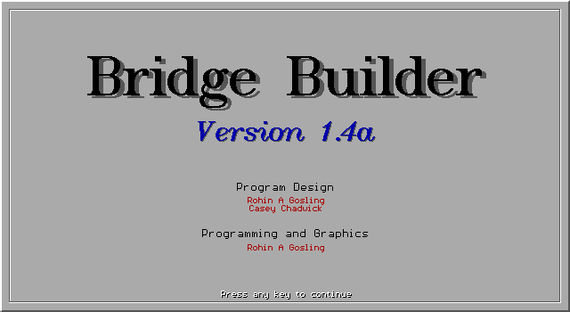
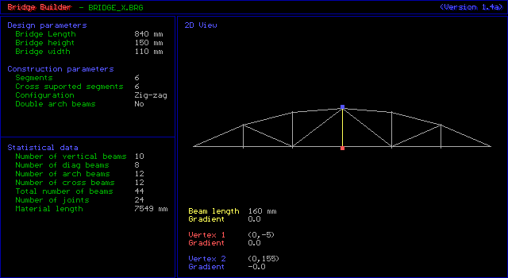
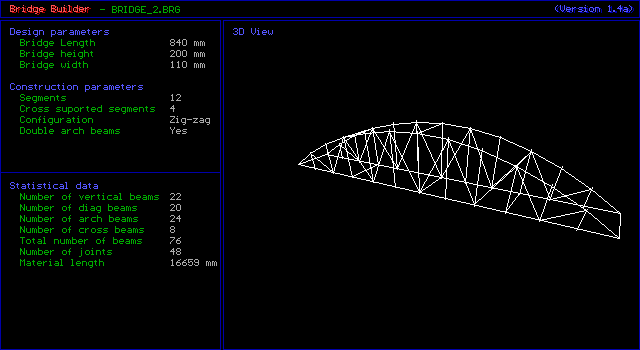
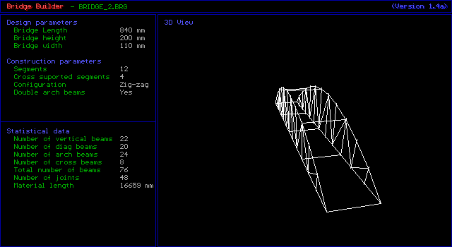
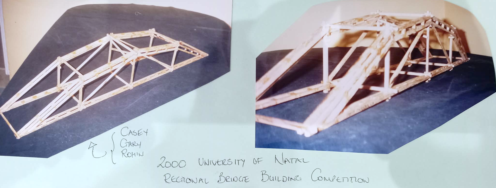
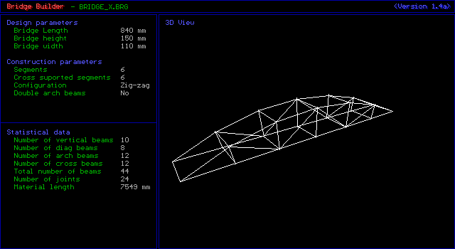

# Bridge Builder


**Authors:** Casey Chadwick, Rohin A. Gosling<br>
**Version:** 1.4a<br>
**Year:** 2000


An interactive bridge design utility for modelling parabolic truss bridges. Renders real-time 2D orthographic and 3D perspective views of parameterized, parabolic, truss-bridge structures.

This software was written to facilitate the design, budgeting, and construction of model bridge for an academic bridge building competition. The physical bridge built using the software to guide design, placed **2nd** in the competition for load capacity, and **1st** for design architecture.




||||
|:---:|:---:|:---:|
|  |  |  |




## Features

- Parametric design of parabolic suspension bridges with adjustable length, height, width, and segment count.
- Three structural configurations: Hanging, Support, and Zig-zag.
- Real-time 2D orthographic and 3D perspective rendering with smooth rotation.
- Double-buffered 3D display with vertical retrace synchronization for flicker-free animation.
- Individual beam inspection showing length, gradient, and vertex coordinates.
- Ten save/load slots for bridge designs.



## Requirements

- DOS-compatible environment (or a DOS emulator such as DOSBox).
- Borland BGI runtime files in the same directory as the executable:
  - `EGAVGA.BGI` -- VGA graphics driver
  - `LITT.CHR` -- Small font
  - `TRIP.CHR` -- Triplex font
  - `TSCR.CHR` -- Script font

## Building from Source

The project is compiled with the Borland C++ compiler targeting 16-bit DOS:

```
bcc BRIDGE.CPP
```

## Running

Launch the executable in [DOSBox](https://www.dosbox.com/) or any DOS-compatible environment:

```
mount c /path/to/bridge2
c:
BRIDGE.EXE
```

Ensure the BGI runtime files (`EGAVGA.BGI`, `LITT.CHR`, `TRIP.CHR`, `TSCR.CHR`) are in the same directory as `BRIDGE.EXE`.

## Keyboard Controls

### General

| Key               | Action                                                         |
|:------------------|:---------------------------------------------------------------|
| `Esc`             | Exit program                                                   |
| `Tab`             | Toggle active window (Dialog / Model)                          |
| `V`               | Toggle 2D / 3D view                                            |
| `*`               | Reset program to defaults                                      |
| `0` - `9`         | Load bridge from file `BRIDGE_X.BRG`                           |
| `Alt` + `0` - `9` | Save bridge to file `BRIDGE_X.BRG`                             |

### Dialog Window (Parameter Editing)

| Key                    | Action                                                    |
|:-----------------------|:----------------------------------------------------------|
| `Up` / `Down`          | Scroll through design and construction parameters         |
| `Enter`                | Edit a parameter / toggle a setting                       |
| `Left` / `Right`       | Adjust design parameter by 1 mm, or cycle segment values  |
| `Ctrl` + `Left`/`Right`| Adjust design parameter by 10 mm                          |

#### Editable Parameters

| #   | Parameter                | Type      | Range         |
|:----|:-------------------------|:----------|:--------------|
| 1   | Bridge Length             | Numeric   | 0 -- 9999 mm  |
| 2   | Bridge Height             | Numeric   | 0 -- 9999 mm  |
| 3   | Bridge Width              | Numeric   | 0 -- 9999 mm  |
| 6   | Segments                  | Numeric   | 2 -- 20 (step 2) |
| 7   | Cross-supported Segments  | Numeric   | 2 -- 20       |
| 8   | Configuration             | Toggle    | Hanging / Support / Zig-zag |
| 9   | Double Arch Beams (Vert.) | Toggle    | Yes / No      |
| 10  | Double Arch Beams (Diag.) | Toggle    | Yes / No      |

### 2D View (Model Window Active)

| Key       | Action                          |
|:----------|:--------------------------------|
| `+`       | Select next construction beam   |
| `-`       | Select previous construction beam |

### 3D View (Model Window Active)

| Key          | Action                                 |
|:-------------|:---------------------------------------|
| `Up` / `Down`   | Rotate model about the X axis (pitch)  |
| `Left` / `Right` | Rotate model about the Y axis (yaw)    |

## Bridge File Format (.BRG)

Bridge designs are saved as binary files named `BRIDGE_0.BRG` through `BRIDGE_9.BRG`. Each file is 62 bytes and contains a file header followed by the bridge data structure.

### File Layout

| Offset | Size (bytes) | Field                      | Description                                                        |
|-------:|-------------:|:---------------------------|:-------------------------------------------------------------------|
|      0 |           20 | ID String                  | `"Bridge Builder"` followed by CR, LF, NUL, padded to 20 bytes    |
|     20 |            2 | Major Version              | Major version number (16-bit integer, e.g. `1` for version 1.4)   |
|     22 |            2 | Minor Version              | Minor version number (16-bit integer, e.g. `4` for version 1.4)   |
|     24 |            4 | Height                     | Bridge height in mm (32-bit float)                                 |
|     28 |            4 | Length                     | Bridge length in mm (32-bit float)                                 |
|     32 |            4 | Width                      | Bridge width in mm (32-bit float)                                  |
|     36 |            2 | Material Length             | Total construction material length in mm (16-bit integer)          |
|     38 |            4 | Joint Overlap              | Joint overlap distance in mm (32-bit float)                        |
|     42 |            2 | Num Segments               | Number of arch segments (16-bit integer)                           |
|     44 |            2 | Num Cross-Supported Segs   | Number of cross-supported segments (16-bit integer)                |
|     46 |            2 | Configuration              | 0 = Hanging, 1 = Support, 2 = Zig-zag (16-bit integer)            |
|     48 |            2 | Split Vertical Beams       | 0 = No, 1 = Yes (16-bit enum)                                     |
|     50 |            2 | Split Diagonal Beams       | 0 = No, 1 = Yes (16-bit enum)                                     |
|     52 |            2 | Num Vertical Beams         | Total vertical beams (16-bit integer, computed)                    |
|     54 |            2 | Num Diagonal Beams         | Total diagonal beams (16-bit integer, computed)                    |
|     56 |            2 | Num Cross Beams            | Total cross-support beams (16-bit integer, computed)               |
|     58 |            2 | Num Arch Beams             | Total arch beams (16-bit integer, computed)                        |
|     60 |            2 | Num Joints                 | Total joints (16-bit integer, computed)                            |

**Total file size: 62 bytes.**

All multi-byte values are stored in little-endian byte order (x86). The 16-bit integer and float sizes reflect the Borland C++ 16-bit DOS memory model, where `int` is 2 bytes and `float` is 4 bytes (IEEE 754 single-precision).

## License

This project is licensed under the [MIT License](LICENSE).
