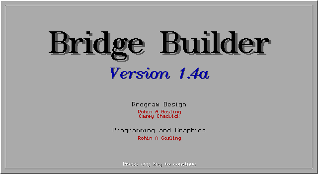
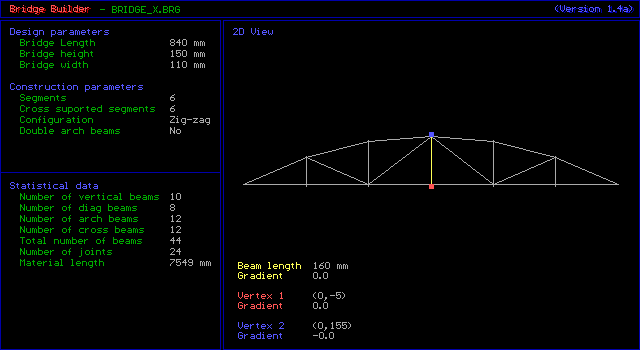
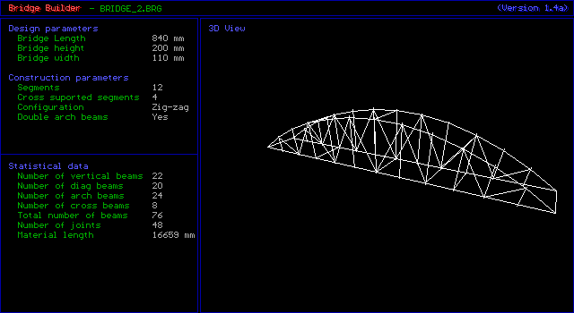
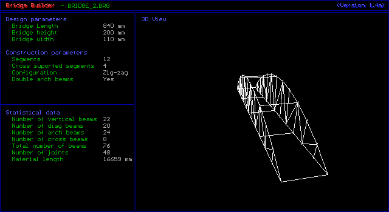

# Bridge Builder


**Authors:** Rohin Gosling, Casey Chadwick<br>
**Version:** 1.4a<br>
**Year:** 2000

<p align="center">
  
</p>

<p align="center">
  &emsp;
  &emsp;
  
</p>

[🌉 Photo of the physical bridge entered into the competition](IMAGE/CAPTURE/BridgeBuild2.png)

An interactive bridge design utility for modelling parabolic tied-arch bridges. Renders real-time 2D orthographic and 3D perspective views of parameterized, parabolic, tied-arch bridge designs.

This software was written to facilitate the design, budgeting, and construction of a model bridge for an academic bridge building competition. The physical bridge built using the software to guide design, placed **2nd** in the competition for load capacity, and **1st** for design architecture.


## 🧭 Table of Contents

- [✨ Features](#-features)
- [📐 Bridge Geometry](#-bridge-geometry)
- [📋 Requirements](#-requirements)
- [🔨 Building from Source](#-building-from-source)
- [▶️ Running](#-running)
- [⌨️ Keyboard Controls](#-keyboard-controls)
- [💾 Bridge File Format (.BRG)](#-bridge-file-format-brg)
- [📄 License](#-license)

## ✨ Features

- Parametric design of parabolic tied-arch bridges with adjustable length, height, width, and segment count.
- Three structural configurations: Hanging, Support, and Zig-zag.
- Real-time 2D orthographic and 3D perspective rendering with smooth rotation.
- Double-buffered 3D display with vertical retrace synchronization for flicker-free animation.
- Individual beam inspection showing length, gradient, and vertex coordinates.
- Ten save/load slots for bridge designs.

## 📐 Bridge Geometry

The bridge is a symmetric parabolic truss centered at the origin. All geometry is derived from three user parameters -- length $l$, height $h$, and width $w$ -- plus a segment count $s$ that controls the resolution of the arch.

### Parabolic Arch

The arch profile follows a downward-opening parabola that passes through the endpoints of the road bed and reaches its apex at the bridge midpoint. With the bridge centered on the $x$-axis so that the road bed spans from $-\tfrac{l}{2}$ to $+\tfrac{l}{2}$, the arch height at any position $x$ is:

$$y(x) = ax^2 + h, \qquad a = -\frac{h}{\left(\tfrac{l}{2}\right)^2}$$

At $x = 0$ (midpoint) the arch reaches its full height $h$. At $x = \pm\tfrac{l}{2}$ (the ends) the arch meets the road bed at $y = 0$.

### Structural Elements

The arch is sampled at $s$ equally-spaced segments of width $\Delta x = \tfrac{l}{s}$. At each sample point the program evaluates the parabola to obtain the arch height, then generates five categories of beam:

| Element | Description |
|:--------|:------------|
| **Vertical beams** | Connect the road bed ($y = 0$) to the arch point $y(x)$ at each sample. |
| **Arch beams** | Connect consecutive arch points, forming the curved top chord. |
| **Diagonal beams** | Brace between the road bed and the arch in one of three configurations: *Hanging* (road to farther arch point), *Support* (road to nearer arch point), or *Zig-zag* (alternating). |
| **Cross beams** | Span the bridge width $w$ at road level and at the arch, tying the two sides together. |
| **Road bed** | Two longitudinal beams running the full length of the bridge, one on each side. |

All elements are generated for both sides of the bridge (offset by $\pm\tfrac{w}{2}$ on the $z$-axis), producing a complete 3D truss from the 2D arch profile.

### Material Length

Total construction material is the sum of all beam lengths computed via the 3D Euclidean distance:

$$L_{\text{total}} = \sum_{i=1}^{N} \sqrt{\Delta x_i^2 + \Delta y_i^2 + \Delta z_i^2}$$

When the *double arch beams* option is enabled, arch beam lengths are doubled and extra material is added for splice joints at regular intervals.

## 📋 Requirements

- DOS-compatible environment (or a DOS emulator such as DOSBox).
- Borland BGI runtime files in the same directory as the executable (already provided in `src/`):
  - `EGAVGA.BGI` -- VGA graphics driver
  - `LITT.CHR` -- Small font
  - `TRIP.CHR` -- Triplex font
  - `TSCR.CHR` -- Script font

## 🔨 Building from Source

All source files, build scripts, and runtime assets live in the `src/` directory. Compile with the Borland C++ compiler (targeting 16-bit DOS) by running the provided batch script from within `src/`:

```
cd src
build
```

`BUILD.BAT` compiles each `.CPP` module with the large memory model (`-ml`) and links them with `GRAPHICS.LIB` to produce `BRIDGE.EXE`. Run `clean` to remove the build artifacts.

## ▶️ Running

Launch the executable in [DOSBox](https://www.dosbox.com/) or any DOS-compatible environment. `BRIDGE.EXE` and its runtime assets live in `src/`, so run it from there:

```
mount c /path/to/bridge-builder
c:
cd src
BRIDGE.EXE
```

The BGI runtime files (`EGAVGA.BGI`, `LITT.CHR`, `TRIP.CHR`, `TSCR.CHR`) and the `BRIDGE_*.BRG` save slots reside in `src/` alongside `BRIDGE.EXE`, so the program locates them automatically when run from that directory.

## ⌨️ Keyboard Controls

### General

| Key               | Action                                                         |
|:------------------|:---------------------------------------------------------------|
| `Esc`             | Exit program                                                   |
| `Tab`             | Toggle active window (Dialog / Model)                          |
| `V`               | Toggle 2D / 3D view                                            |
| `*`               | Reset program to defaults                                      |
| `0` - `9`         | Load bridge from file `BRIDGE_X.BRG`                           |
| `Alt` + `0` - `9` | Save bridge to file `BRIDGE_X.BRG`                             |

### Dialog Window (Parameter Editing)

| Key                    | Action                                                    |
|:-----------------------|:----------------------------------------------------------|
| `Up` / `Down`          | Scroll through design and construction parameters         |
| `Enter`                | Edit a parameter / toggle a setting                       |
| `Left` / `Right`       | Adjust design parameter by 1 mm, or cycle segment values  |
| `Ctrl` + `Left`/`Right`| Adjust design parameter by 10 mm                          |

#### Editable Parameters

| #   | Parameter                | Type      | Range         |
|:----|:-------------------------|:----------|:--------------|
| 1   | Bridge Length             | Numeric   | 0 -- 9999 mm  |
| 2   | Bridge Height             | Numeric   | 0 -- 9999 mm  |
| 3   | Bridge Width              | Numeric   | 0 -- 9999 mm  |
| 6   | Segments                  | Numeric   | 2 -- 20 (step 2) |
| 7   | Cross-supported Segments  | Numeric   | 2 -- 20       |
| 8   | Configuration             | Toggle    | Hanging / Support / Zig-zag |
| 9   | Double Arch Beams (Vert.) | Toggle    | Yes / No      |
| 10  | Double Arch Beams (Diag.) | Toggle    | Yes / No      |

### 2D View (Model Window Active)

| Key       | Action                          |
|:----------|:--------------------------------|
| `+`       | Select next construction beam   |
| `-`       | Select previous construction beam |

### 3D View (Model Window Active)

| Key          | Action                                 |
|:-------------|:---------------------------------------|
| `Up` / `Down`   | Rotate model about the X axis (pitch)  |
| `Left` / `Right` | Rotate model about the Y axis (yaw)    |

## 💾 Bridge File Format (.BRG)

Bridge designs are saved as binary files named `BRIDGE_0.BRG` through `BRIDGE_9.BRG`. Each file is 62 bytes and contains a file header followed by the bridge data structure.

### File Layout

| Offset | Size (bytes) | Field                      | Description                                                        |
|-------:|-------------:|:---------------------------|:-------------------------------------------------------------------|
|      0 |           20 | ID String                  | `"Bridge Builder"` followed by CR, LF, NUL, padded to 20 bytes    |
|     20 |            2 | Major Version              | Major version number (16-bit integer, e.g. `1` for version 1.4)   |
|     22 |            2 | Minor Version              | Minor version number (16-bit integer, e.g. `4` for version 1.4)   |
|     24 |            4 | Height                     | Bridge height in mm (32-bit float)                                 |
|     28 |            4 | Length                     | Bridge length in mm (32-bit float)                                 |
|     32 |            4 | Width                      | Bridge width in mm (32-bit float)                                  |
|     36 |            2 | Material Length             | Total construction material length in mm (16-bit integer)          |
|     38 |            4 | Joint Overlap              | Joint overlap distance in mm (32-bit float)                        |
|     42 |            2 | Num Segments               | Number of arch segments (16-bit integer)                           |
|     44 |            2 | Num Cross-Supported Segs   | Number of cross-supported segments (16-bit integer)                |
|     46 |            2 | Configuration              | 0 = Hanging, 1 = Support, 2 = Zig-zag (16-bit integer)            |
|     48 |            2 | Split Vertical Beams       | 0 = No, 1 = Yes (16-bit enum)                                     |
|     50 |            2 | Split Diagonal Beams       | 0 = No, 1 = Yes (16-bit enum)                                     |
|     52 |            2 | Num Vertical Beams         | Total vertical beams (16-bit integer, computed)                    |
|     54 |            2 | Num Diagonal Beams         | Total diagonal beams (16-bit integer, computed)                    |
|     56 |            2 | Num Cross Beams            | Total cross-support beams (16-bit integer, computed)               |
|     58 |            2 | Num Arch Beams             | Total arch beams (16-bit integer, computed)                        |
|     60 |            2 | Num Joints                 | Total joints (16-bit integer, computed)                            |

**Total file size: 62 bytes.**

All multi-byte values are stored in little-endian byte order (x86). The 16-bit integer and float sizes reflect the Borland C++ 16-bit DOS memory model, where `int` is 2 bytes and `float` is 4 bytes (IEEE 754 single-precision).

## 📄 License

This project is licensed under the [MIT License](LICENSE).
